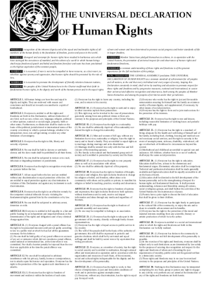

## مقدمهٔ مزدکیار
برای زندگی مسالمت آمیز در یک جامعهٔ رو به رشد، و برای فراهم ساختن شرایط رشد اجتماعی، فکری و معنوی همهٔ افراد بشر، لازم است افراد از حقوق و آزادی های خود آگاه باشند. این آگاهی امکان می دهد از حقوق اساسی خود دفاع کنند و حقوق اساسی دیگران را رعایت کنند.

معقول است که حقوق و آزادی های اساسی بشری به نوع حکومت ملی، مرام سیاسی یا عقاید مذهبی وابسته نباشد. از یک سو چون این امور برای هر کشور و برای هر گروه عقیدتی و سیاسی متفاوت است. از سوی دیگر این امور اعتباری و قراردادی اند و با گذر زمان ممکن است تغییر کنند. پس اگر قرار بود حقوق و آزادی های اساسی بشر به این امور وابسته باشد، امکان نداشت همهٔ ملتهای جهان بر سر آن توافق کنند، و امکان نداشت اعلامیه‌ٔ حقوق بشر به شکل یک مرجع بین المللی مورد استفاده قرار بگیرد. یا ممکن بود با تغییر هر یک از این امور قراردادی، برای مثال با تغییر نوع حکومت یا تغییر عقاید مذهبی جامعه، حقوق بشر نیز تغییر می کردند، و درنتیجه بنیانهای اجتماعی مبتنی بر آن نیز فرومی ریختند.

مهمترین سند حقوق بشر، اعلامیهٔ جهانی حقوق بشر است که در سال ۱۹۴۸ میلادی مقارن با ۱۳۲۷ خورشیدی، یعنی در ابتدای سلطنت محمدرضاشاه پهلوی، در صد و هشتاد و سومین اجلاس عمومی مجمع عمومی سازمان ملل با شرکت نمایندگانی از همهٔ ملل دنیا تصویب و اعلام شده است.

شرایط سیاسی و اجتماعی ایران در آن دوران به گونه ای بود که بسیاری از این حقوق و آزادی‌ها در ایران نقض می شده است. نقض این حقوق طی سالها شدت یافت. در ۱۳۵۷ خورشیدی مردم ایران به دلایل مختلف سیاسی، اقتصادی و اجتماعی و فرهنگی و از جمله امکان بهره مندی از این حقوق و آزادی ها، با انقلابی که بعدها انقلاب اسلامی نام گرفت، حکومت سلطنتی پهلوی را سرنگون کردند و امیدوار بودند با تشکیل یک حکومت جدید، این حقوق به آنان داده شود. اما با مطالعه‌ٔ منابع تاریخی معاصر و با مشاهدهٔ مستقیم شرایط کشور درمی‌یابیم که از همان فردای شروع کار حکومت جمهوری اسلامی، نقض این حقوق و آزادی ها در ایران بار دیگر آغاز شد و هنوز هم با همان شدت ادامه دارد.

جالب اینجا است که سومین بند مقدمهٔ همین اعلامیهٔ حقوق بشر در مورد امکان قیام ملتها در مقابل ظلم و فشار و برای کسب حقوق ذاتی بشری هشدار می‌دهد. این هشدار در سال ۱۳۲۷ و پس از آن برای حکومت پهلوی درس عبرت نشد. پس از انقلاب ۱۳۵۷ و تا امروز نیز هنوز برای مقامات ارشد جمهوری اسلامی درس عبرت نشده است. آیا این مقامات پیش از آنکه دیر شود سر عقل می آیند، یا قصد دارند با یک فروپاشی و سرنگونی قهری، به زباله دان تاریخ بپیوندند؟

به این دلایل ما معتقدیم هر شهروند ایرانی باید به نسخهٔ باکیفیت اعلامیه‌ٔ جهانی حقوق بشر دسترسی داشته باشد و بتواند آن را با دیگران به اشتراک بگذارد.

متن اصلی این اعلامیه در [ سایت کمیتهٔ عالی حقوق بشر وابسته به سازمان ملل](https://www.ohchr.org/EN/UDHR/Pages/UDHRIndex.aspx) قرار دارد. این سایت شامل ترجمه هایی به زبانهای مختلف از این سند است. یکی از ترجمه ها نیز به زبان فارسی است. نسخهٔ انگلیسی این اعلامیه در هردو فرمت متن خالص و PDF با کیفیت مناسب وجود دارد. این واقعیت به افراد امکان می‌دهد متن انگلیسی را جستجو کنند، قسمتهایی از آن را انتخاب کرده و در متن دیگر بچسبانند، یا با ابزارهای پردازش زبان طبیعی پردازش کنند. اما ترجمهٔ فارسی اینگونه نیست. این ترجمه تنها در یک فایل PDF قدیمی قرار دارد که به جای متن تایپ شده، شامل تصویر متن چاپی است. 

متن این اعلامیه همراه با چند اعلامیهٔ حقوقی دیگر پیش از این در سال ۱۳۷۲ در کتاب *اعلامیه های حقوق بشر* به قلم استاد *هوشنگ ناصر زاده* چاپ شده است. می توانید متن چاپی این کتاب را از موسسهٔ انتشارات جهاد دانشگاهی تهیه کنید، یا نسخهٔ پی.دی.اف آن را از [سایت کتابناک](https://ketabnak.com/book/89124/%D8%A7%D8%B9%D9%84%D8%A7%D9%85%DB%8C%D9%87-%D9%87%D8%A7%DB%8C-%D8%AD%D9%82%D9%88%D9%82-%D8%A8%D8%B4%D8%B1) دریافت کنید.

منابع اینترنتی دیگری که نسخهٔ فارسی این اعلامیه را ارائه می دهند عبارتند از:
* [صفحهٔ سایت سازمان ملل متحد، بخش جمهوری اسلامی ایران](https://iran.un.org/fa/25935-alamyh-jhany-hqwq-bshr)
* [صفحهٔ ویکیپدیای فارسی در مورد اعلامیه جهانی حقوق بشر](https://fa.wikipedia.org/wiki/%D8%A7%D8%B9%D9%84%D8%A7%D9%85%DB%8C%D9%87_%D8%AC%D9%87%D8%A7%D9%86%DB%8C_%D8%AD%D9%82%D9%88%D9%82_%D8%A8%D8%B4%D8%B1)
* [این صفحه از سایت پژوه متعلق به پژوهشکدهٔ باقرالعلوم](http://pajoohe.ir/%D9%85%D8%AA%D9%86-%D8%A7%D8%B9%D9%84%D8%A7%D9%85%DB%8C%D9%87-%D8%AC%D9%87%D8%A7%D9%86%DB%8C-%D8%AD%D9%82%D9%88%D9%82-%D8%A8%D8%B4%D8%B1__a-20480.aspx)

در همان سال ۱۹۴۸ [یک نسخه از این اعلامیه](https://en.wikipedia.org/wiki/File:The_universal_declaration_of_human_rights_10_December_1948.jpg) در یک برگ کاغذ بزرگ چاپ شد و در اختیار دولتهای مختلف قرار گرفت. ما این نسخه را نیز با همان شکل و شمایل و در ابعاد کاغذ A2 تایپ کرده ایم و در یک فایل PDF قرار داده ایم که می‌توانید [از همینجا دانلود کنید](./UDHR-english-single-page.pdf).

## مقدمهٔ دفتر کمیتهٔ عالی حقوق بشر
اعلامیهٔ جهانی حقوق بشر یا UDHR سند مهمی در تاریخ حقوق بشر است. این سند که پیشنویس آن توسط نمایندگانی با پسزمینهٔ حقوقی و فرهنگی متفاوت از سراسر دنیا تهیه شده، برای نخستین بار موجب شد حقوق بشر اساسی در تمام دنیا مور حفاظت قرار گیرد. مجمع عمومی سازمان ملل در صد و هشتاد و سومین جلسهٔ عمومی در پاریس، در ۱۰ دسامبر ۱۹۴۸ میلادی (مقارن با آذرماه ۱۳۲۷ خورشیدی) این اعلامیه را پذیرفت.

اعلامیهٔ جهانی حقوق بشر سندی است که بیش از همهٔ اسناد دیگر به زبانهای مختلف ترجمه شده است. این سند در سال ۱۹۹۹ میلادی در دنیا  رکورددار بیشترین ترجمه بوده است. هدف ما (کمیته‌ٔ عالی حقوق بشر) اشتراک اعلامیهٔ جهانی حقوق بشر با همه‌ٔ دنیا است، و هر فردی می تواند در ترجمهٔ این سند به زبانی که از پیش در مجموعهٔ ترجمه ها موجود نیست مشارکت کند. ما (کمیتهٔ عالی حقوق بشر) همچنین یک مجموعه از اسناد را درمورد این اعلامیه نگهداری می‌کنیم که همواره در ستاد کمیته در ژنو، سویس قرار دارد. اگر تمایل دارید در مورد این اعلامیه مطالبی ارسال کنید، با ما (کمیته‌ٔ عالی حقوق بشر)تماس بگیرید.

## ترجمهٔ رسمی فارسی اعلامیهٔ جهانی حقوق بشر
### مقدمه
**از آنجا که** شناسایی حیثیت ذاتی کلیه‌ٔ اعضای خانوادهٔ بشری و حقوق یکسان و انتقال ناپذیر آنان اساس آزادی و عدالت و صلح را در جهان تشکیل می‌دهد،

**از آنجا که** عدم شناسایی و تحقیر حقوق بشر منتهی به اعمال وحشیانه ای گردیده است که روح بشر را به عصیان واداشته و ظهور دنیایی که در آن افراد بشر در بیان و عقیده آزاد و از ترس و فقر فارغ باشند بعنوان بالاترین آمال بشر اعلام شده است،

**از آنجا که** اساساً حقوق انسانی را باید با اجرای قانون حمایت کرد تا بشر بعنوان آخرین علاج به قیام بر ضد ضلم و فشار مجبور نگردد،

**از آنجا که** اساساً لازم است توسعهٔ روابط دوستانه بین ملل را مورد تشویق قرار داد،

**از آنجا که** مردم ملل متحد ایمان خود را به حقوق اساسی بشر و مقام و ارزش فرد انسانی و تساوی حقوق مرد و زن مجدداً در منشور اعلام کرده اند و تصمیم راسخ گرفته اند که به پیشرفت اجتماعی کمک کنند و در محیطی آزادتر وضع زندگی بهتری به وجود آورند،

**از آنجا که** دول عضو متعهد شده اند که احترام واقعی حقوق بشر و آزادی های اساسی را با همکاری سازمان ملل متحد تامین کنند،

**از آنجا که** حسن تفاهم مشترکی به این حقوق و آزادیها برای اجرای کامل این تعهد کمال اهمیت را دارد،

مجمع عمومی این اعلامیهٔ جهانی حقوق بشر را آرمان مشترکی برای تمام مردم و کلیهٔ ملل اعلام می کند تا جمیع افراد و همهٔ ارکان اجتماع این اعلامیه را دائماً در مدنظر داشته باشند و مجاهدت کنند که به وسیلهٔ تعلیم و تربیت احترام این حقوق و آزادیها توسعه یابد و با تدابیر تدریجی ملی و بین المللی، شناسایی و اجرای واقعی و حیاتی آنها، چه در میان خود ملل عضو و چه در بین مردم کشورهایی که در قلمرو آنها می باشند تامین گردد.

### مادهٔ یکم
 تمام افراد بشر آزاد به دنیا می آیند و از لحاظ حیثیت و حقوق با هم برابرند. همه دارای عقل و وجدان می باشند و باید نسبت به یکدیگر با روح برادری رفتار کنند.

### مادهٔ دوم
1. هرکس می تواند بدون هیچگونه تمایز مخصوصاً از حیث نژاد، رنگ، جنس، زبان، مذهب، عقیدهٔ سیاسی یا هر عقیدهٔ دیگر و همچنین ملیت، وضع اجتماعی، ثروت، ولادت یا هر موقعیت دیگر، از تمام حقوق و کلیهٔ آزادی هایی که در اعلامیه ذکر شده است، بهره مند گردد.
2. به علاوه هیچ تبعیضی به عمل نخواهد آمد که مبتنی بر وضع سیاسی، اداری و قضایی یا بین المللی کشور یا سرزمینی باشد که شخص به آن تعلق دارد، خواه این کشور مستقل، تحت قیمومت یا غیرخودمختار بوده یا حاکمیت آن به شکلی محدود شده باشد.

### مادهٔ سوم
هرکس حق زندگی، آزادی و امنیت شخصی دارد.

### مادهٔ چهارم
احدی را نمی توان در بردگی نگاه داشت و دادوستد بردگان به هرشکلی که باشد ممنوع است.

### مادهٔ پنجم
احدی را نمی توان تحت شکنجه یا مجازات یا رفتاری قرار داد که ظالمانه و یا برخلاف انسانیت و شئون بشری یا موهن باشد.

### مادهٔ ششم
هر کس‌ حق دارد که شخصیت حقوقی او همه جا به عنوان یک انسان در مقابل قانون شناخته شود.

### مادهٔ هفتم
همه در برابر قانون مساوی هستند و حق دارند بدون تبعیض و بالسویه از حمایت قانون برخوردار شوند. همه حق دارند در مقابل هر تبعیضی که ناقض اعلامیهٔ حاضر باشد و برعلیه هر تحریکی که برای چنین تبعیضی به عمل آید بطور مساوی از حمایت قانون بهره مند شوند.

### مادهٔ هشتم  
در برابر اعمالی که حقوق اساسی فرد را مورد تجاوز قرار بدهد و آن حقوق بوسیلهٔ قانون اساسی یا قانون دیگری برای او شناخته شده باشد، هر کس حق رجوع موثر به محاکم ملی صالحه دارد.

### مادهٔ نهم
احدی نمی تواند خودسرانه توقیف، حبس یا تبعید بشود.

### مادهٔ دهم
هر کس با مساوات کامل حق دارد که دعوایش به وسیلهٔ دادگاه مستقل و بی طرفی، منصفانه و علناً رسیدگی بشود و چنین دادگاهی دربارهٔ حقوق و الزامات او یا هر اتهام جزایی که به او توجه پیدا کرده باشد اتخاذ تصمیم بنماید.

### مادهٔ یازدهم
1. هرکس که به بزه کاری متهم شده باشد بی گناه محسوب خواهد شد تا وقتی که در جریان یک دعوای عمومی که در آن کلیهٔ تضمینهای لازم برای دفاع او تامین شده باشد تقصیر او قانوناً محرز گردد.
2. هیچکس برای انجام یا عدم انجام عملی که در موقع ارتکاب، آن عمل به موجب حقوق ملی یا بین المللی جرم شناخته نمی شده است محکوم نخواهد شد. به همین طریق هیچ مجازاتی شدیدتر از آنچه که در موقع ارتکاب جرم بدان تعلق می گرفت دربارهٔ احدی اعمال نخواهد شد.

### مادهٔ دوازدهم
احدی در زندگی خصوصی، امور خانوادگی، اقامتگاه یا مکاتبات خود نباید مورد مداخله های خودسرانه واقع شود و شرافت و اسم و رسمش نباید مورد حمله قرار گیرد. هرکس حق دارد که در مقابل اینگونه مداخلات و حملات مورد حمایت قانون قرارگیرد.

### مادهٔ سیزدهم
1. هرکس حق دارد که در داخل هر کشود آزادانه عبود و مرور کند و محل اقامت خود را انتخاب نماید.
2. هرکس حق دارد هر کشوری و از جمله کشور خود را ترک کند یا به کشور خود بازگردد.

### مادهٔ چهاردهم
1. هرکس حق دارد دربرابر تعقیب، شکنجه و آزار پناهگاهی جستجو کند و در کشورهای دیگر پناه اختیار کند.
2. درموردی که تعقیب واقعاً مبتنی به جرم عمومی و غیرسیاسی یا رفتارهایی مخالف با اصول و مقاصد ملل متحد باشد، نمی توان از این حق استفاده نمود.

### مادهٔ پانزدهم
1. هرکس حق دارد که دارای تابعیت باشد.
2. احدی را نمی توان خودسرانه از تابعیت خود یا از حق تغییر تابعیت محروم کرد.

### مادهٔ شانزدهم
1. هر زن و مرد بالغی حق دارند بدون هیچگونه محدودیت از نظر نژاد، ملیت، تابعیت یا مذهب با همدیگر زناشویی کنند و تشکیل خانواده بدهند. در تمام مدت زناشویی و هنگام انحلال آن، زن و شوهر در کلیهٔ امور مربوط به ازدواج دارای حقوق مساوی می باشند.
2. ازدواج باید با رضایت کامل و آزادانهٔ زن و مرد واقع شود.
3. خانواده رکن طبیعی و اساسی اجتماع است و حق دارد از حمایت جامعه و دولت بهره مند شود.

### مادهٔ هفدهم
1. هر شخص منفرداً یا به طور اجتماع حق مالکیت دارد.
2. احدی را نمی توان خودسرانه از حق مالکیت محروم نمود.

### مادهٔ هجدهم
هرکس حق دارد که از آزادی فکر و وجدان و مذهب بهره مند شود. این حق متضمن آزادی تغییر مذهب یا عقیده و همچنین متضمن آزادی اظهار عقیده و ایمان می باشد و نیز شامل تعلیمات مذهبی و اجرای مراسم دینی است. هرکس می تواند از این حقوق منفرداً یا مجتمعاً، به طور خصوصی یا به طور عمومی برخوردار باشد.

### ماده نوزدهم
هرکس حق آزادی عقیده و بیان دارد و حق مزبور شامل آن است که از داشتن عقاید خود بیم و اضطرابی نداشته باشد و در کسب اطلاعات و افکار و در اخذ و انتشار آن به تمام وسائل ممکن و بدون ملاحظات مرزی آزاد باشد.

### مادهٔ بیستم
1. هرکس حق دارد آزادانه مجامع و جمعیتهای مسالمت آمیز تشکیل دهد.
2. هیچکس را نمی توان مجبور به شرکت در اجتماعی کرد.

### مادهٔ بیست و یکم
1. هرکس حق دارد که در ادارهٔ امور عمومی کشور خود، خواه مستقیماً و خواه با وساطت نمایندگانی که آزادانه انتخاب شده باشند شرکت جوید.
2. هرکس حق دارد با تساوی شرایط، به مشاغل عمومی کشور خود نایل آید.
3. اساس و منشاء قدرت حکومت، ارادهٔ مردم است. این اراده باید به وسیلهٔ انتخاباتی ابراز گردد که از روی صداقت و به طور ادواری صورت پذیرد. انتخابات باید عمومی و با رعایت مساوات باشد و با رای مخفی یا طریقه ای نظیر آن انجام گیرد که آزادی رای را تامین نماید.

### مادهٔ بیست و دوم
هرکس به عنوان عضو اجتماع حق امنیت اجتماعی دارد و مجاز است به وسیلهٔ مساعی ملی و همکاری بین المللی، حقوق اقتصادی و اجتماعی و فرهنگی خود را که لازمهٔ مقام و نمو آزادانهٔ شخصیت او است با رعایت تشکیلات و منابع هر کشور به دست آورد.

### مادهٔ بیست و سوم
1. هرکس حق دارد کار کند، کار خود را به طور آزادانه انتخاب نماید، شرایط منصفانه و رضایت بخشی برای کار خواستار باشد و در مقابل بیکاری مورد حمایت قرار گیرد.
2. همه حق دارند که بدون هیچ تبعیضی، در مقابل کار مساوی، اجرت مساوی دریافت دارند.
3. هرکس که کار می کند به مزد منصفانه و رضایت بخشی ذیحق می شود که زندگی او و خانواده اش را موافق شئون انسانی تامین کند و آن را در صورت لزوم با هرنوع وسائل دیگر حمایت اجتماعی تکمیل نماید.
4. هرکس حق دارد که برای دفاع از منافع خود با دیگران اتحادیه تشکیل دهد و در اتحادیه ها نیز شرکت کند.

### مادهٔ بیست و چهارم
هرکس حق استراحت و فراغت و تفریح دارد و به خصوص به محدودیت معقول ساعات کار و مرخصی های ادواری با اخذ حقوق ذیحق می باشد.

### مادهٔ بیست و‌پنجم
1. هرکسی حق دارد که سطح زندگانی او سلامتی و رفاه خود و خانواده اش را از حیث خوراک و مسکن و مراقبتهای طبی و خدمات لازم اجتماعی تامین کند و همچنین حق دارد که در مواقع بیکاری، بیماری، نقص اعضاء، بیوگی، پیری یا در تمام موارد دیگری که به علل خارج از ارادهٔ انسان وسائل امرار معاش از دست رفته باشد از شرایط آبرومندانهٔ زندگی برخوردار شود.
2. مادران و کودکان حق دارند که از کمک و مراقبت مخصوصی بهره مند شوند. کودکان چه بر اثر ازدواج و چه بدون ازدواج به دنیا آمده باشند، حق دارند که همه از یک نوع حمایت اجتماعی برخوردار شوند.

### مادهٔ بیست و ششم
1. هرکس حق دارد که از آموزش و پرورش بهره مند شود. آموزش و پرورش لااقل تا حدودی که مربوط به تعلیمات ابتدائی و اساسی است باید مجانی باشد. آموزش ابتدائی اجباری است. آموزش حرفه ای باید عمومیت پیدا کند و آموزش عالی باید با شرایط تساوی به روی همه باز باشد تا همه بنا به استعداد خود بتوانند از آن بهره مند گردند.
2. آموزش و پرورش باید طوری هدایت شود که شخصیت انسانی هرکس را به حد اکمل رشد آن برساند و احترام حقوق و آزادی های بشر را تقویت کند. آموزش و پرورش باید حسن تفاهم، گذشت و احترام عقاید مخالف و دوستی بین تمام ملل و جمعیتهای نژادی یا مذهبی و همچنین توسعهٔ فعالیتهای ملل متحد را در راه حفظ صلح تسهیل نماید.
3. پدر و مادر در انخاب نوع آموزش و پرپرش فرزندان خود نسبت به دیگران اولویت دارند.

### مادهٔ بیست و هفتم
1. هرکس حق دارد آزادانه در زندگی فرهنگی اجتماع شرکت کند، از فنون و هنرها متمتع گردد و در پیشرفت علمی و فوائد آن سهیم باشد.
2. هرکس حق دارد از حمایت منافع معنوی و مادی آثار علمی، فرهنگی یا هنری خود برخوردار شود.

### مادهٔ بیست و هشتم
هرکس حق دارد برقراری نظمی را بخواهد که از لحاظ اجتماعی و بین المللی حقوق و آزادی هایی را که در این اعلامیه ذکر گردیده است تامین کند و آنها را به مورد عمل بگذارد.

### مادهٔ بیست و نه
1. هرکس در مقابل آن جامعه ای وظیفه دارد که رشد آزاد و کامل شخصیت او را میسر سازد.
2. هرکس در اجرای حقوق و استفاده از آزادیهای خود فقط تابع محدودیتهایی است که به وسیلهٔ قانون منحصراً به منظور شناسایی و مراعات حقوق و آزادی های دیگران و برای رعایت مقتضیات صحیح اخلاقی و نظم عمومی و رفاه همگانی در شرایط یک جامعهٔ دموکراتیک وضع گردیده است.
3. این حقوق و آزادیها در هیچ موردی نمی تواند بر خلاف مقاصد و اصول ملل متحد اجرا گردد.

### مادهٔ سی ام
هیچیک از مقررات اعلامیهٔ حاضر نباید طوری تفسیر شود که متضمن حقی برای دولتی یا جمعیتی یا فردی باشد که به موجب آن بتوانند هریک از حقوق و آزادی های مندرج در این اعلامیه را از بین ببرند یا در آن راه فعالتی انجام دهند.

## منابع و مراجع
[صفحهٔ سایت کمیتهٔ عالی حقوق بشر در مورد اعلامیهٔ حقوق بشر](https://www.ohchr.org/EN/UDHR/Pages/UDHRIndex.aspx)

[ترجمهٔ رسمی فارسی اعلامیهٔ جهانی حقوق بشر](https://www.ohchr.org/EN/UDHR/Documents/UDHR_Translations/prs.pdf)

[متن انگلیسی رسمی اعلامیهٔ جهانی حقوق بشر](https://www.ohchr.org/EN/UDHR/Pages/Language.aspx?LangID=eng)

