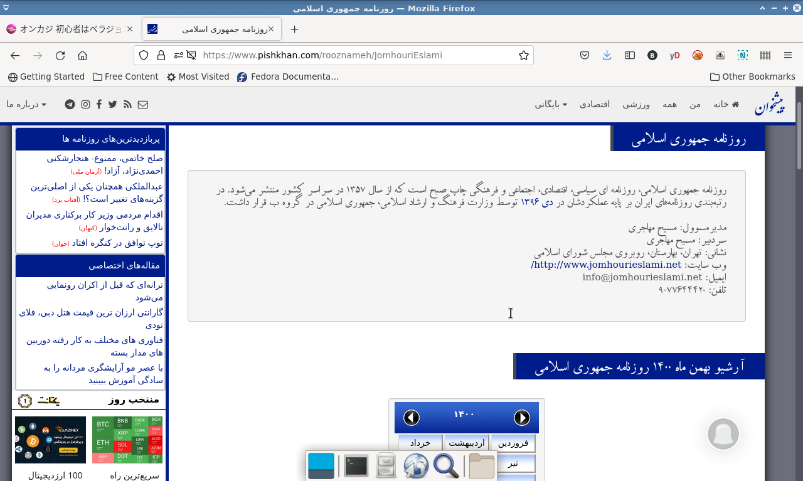
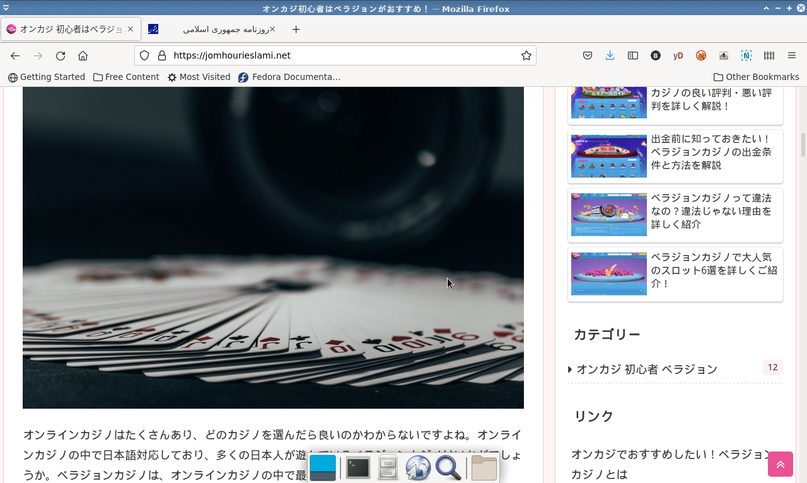
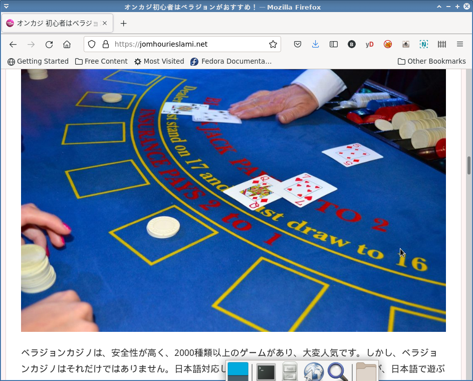

مدتی است، در حدود دو ماه، که وقتی به وبسایت روزنامهٔ جمهوری اسلامی واقع در www.jomhourieslami.net مراجعه می کنیم، به جای شماره های روزنامه و عناوین خبری با تبلیغات قمارخانه های ژاپنی مواجه می شویم!

آدرس سایت روزنامه جمهوری اسلامی در سایت [پیشخوان روزنامه ها](https://www.pishkhan.com/) به همین شکل [https://jomhourieslami.net](https://jomhourieslami.net) ثبت شده است، همانطور که در عکس زیر می بینید.



و وقتی به jomhourieslami.net می رویم، با یک وبسایت قمارخانه به زبان ژاپنی روبرو می شویم!






ما حدس می زنیم اشکالی در یکی یا چندتا از سرویسهای اصلی نام دامنه یا DNS ایرانی به وجود آمده که باعث شده سامانه های ارائه دهندهٔ خدمات اینترنتی یا ISP، کاربران را هنگام درخواست صفحات www.jomhourieslami.net به IP اشتباهی هدایت کنند. برای اینکه بفهمیم IP متناظر با نام دامنهٔ www.jomhourieslami.net چیست، می توانیم از دستور `ping` در خط فرمان رایانه استفاده کنیم. وقتی ما این دستور را اجرا می کنیم نتایج زیر به دست می آید:

```
$ ping www.jomhourieslami.net
PING jomhourieslami.net (27.120.86.32) 56(84) bytes of data.
64 bytes from usv0202.mfro-sv.net (27.120.86.32): icmp_seq=1 ttl=36 time=398 ms
64 bytes from usv0202.mfro-sv.net (27.120.86.32): icmp_seq=2 ttl=36 time=366 ms
64 bytes from usv0202.mfro-sv.net (27.120.86.32): icmp_seq=3 ttl=36 time=366 ms
64 bytes from usv0202.mfro-sv.net (27.120.86.32): icmp_seq=4 ttl=36 time=366 ms
64 bytes from usv0202.mfro-sv.net (27.120.86.32): icmp_seq=5 ttl=36 time=367 ms
^C
--- jomhourieslami.net ping statistics ---
5 packets transmitted, 5 received, 0% packet loss, time 4001ms
rtt min/avg/max/mdev = 365.691/372.538/398.132/12.805 ms
```

این خروجی نشان می دهد هم اکنون دامنهٔ www.jomhourieslami.net به 27.120.86.32 نگاشت می شود. اگر بخواهیم بدانیم سیستمی که این IP را دارد کجای کرهٔ زمین واقع شده می توانیم از سرویس [iplocation.com](https://iplocation.com/) استفاده کنیم. این سرویس به ما می گوید سیستمی با آدرس 27.120.86.32 در کشور ژاپن تحت مالکیت سازمان یا شرکت freebit قرار دارد.

ما دو هفته پیش یک ایمیل به آدرسی که در همین سایت پیشخوان روزنامه ها به عنوان پست الکترونیک روزنامهٔ جمهوری اسلامی ذکر شده بود فرستادیم و سعی کردیم مسئولان این روزنامه را از این موقعیت شرم آور آگاه کنیم. ولی گویا همان سروری که صفحات این سایت رویش قرار دارد، ایمیل ها را نیز دریافت می‌کند و با احتمال زیاد کسی نیست که زبان فارسی بلد باشد و ایمیل های دریافتی را بخواند.

