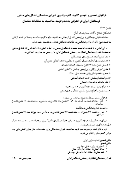

## فراخوان تحصن و تجمع گام به گام سراسری شورای هماهنگی تشکل‌های صنفی فرهنگیان ایران در اعتراض به عدم توجه حاکمیت به مطالبات معلمان، در بهمن ماه جاری

فرهنگیان شجاع و آگاه و مردم شریف ایران

مطالبات قانونی فرهنگیان با بی توجهی کامل از جانب حاکمیت مواجه گردیده است و عملا در تمام ارکان حاکمیت هیچ اراده ای برای پاسخگویی به مطالبات فرهنگیان شاغل و بازنشسته وجود ندارد.

بر این اساس و با توجه به خواست جامعه فرهنگیان مبنی بر ادامه کنش های اعتراضی تا تحقق یافتن خواسته ها، شورای هماهنگی تشکل های صنفی فرهنگیان ایران، برای بهمن ماه جاری در اعتراض به :

1. اجرا نشدن لایحه همسان‌سازی بازنشستگان
2. اعاده رتبه‌بندی از طرف شورای نگهبان به مجلس با هدف اجرایی نشدن آن
3. فراموش شدن ماده ۶۴ قانون مدیریت خدمات کشوری
4. فقدان آموزش رایگان و بی‌توجهی به اصل ۳۰ قانون اساسی
5. عدم پرداخت پاداش پایان خدمت سال ۱۴۰۰
6. عدم استخدام معلمان خرید خدمات آموزشی
7. ظلم مضاعف به نیروهای خدماتی
8. به تاراج بردن سرمایه فرهنگیان در صندوق ذخیره
9. دربند بودن و اخراج کردن معلمان کنشگر و فعال صنفی

فراخوانی در دو مرحله به شرح زیر صادر می نماید :

* الف- روزهای شنبه و یک شنبه ۹ و ۱۰ بهمن ماه تحصن در مدارس و روز دوشنبه ۱۱ بهمن تجمع سراسری

درصورت عدم پاسخگویی به مطالبات

* ب- روز شنبه ۲۳ بهمن تا روز چهارشنبه ۲۷ بهمن تحصن در مدارس و روز پنج شنبه ۲۸ بهمن تجمع سراسری

شورای هماهنگی از تمام فرهنگیان با همراهی خانواده و اولیای دانش آموزان می‌خواهد همبسته و متحدتر از قبل حماسه‌ای پر شور تر رقم بزنند.
لازم به ذکر است در صورت عدم توجه حاکمیت، شورای هماهنگی برای اسفند ماه ، سال جاری کنش هایی به مراتب گسترده تر را اعلام می نماید.

**مکان تحصن:** تمام مدارس ایران

**مکان تجمع**

* استان تهــران : مقابل مجلـس
* مراکز استان‌ها : مقابل اداره کل استان
* شهرستان‌ها : مقابل اداره آموزش و پرورش

*شورای هماهنگی تشکل‌های صنفی فرهنگیان ایران*

سوم بهمن ماه ۱۴۰۰

---
[نسخهٔ قابل چاپ](./documents/newsletter-vol2.pdf)

